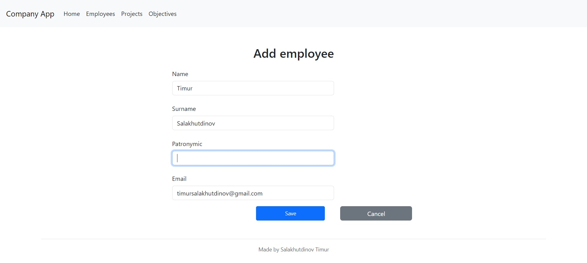
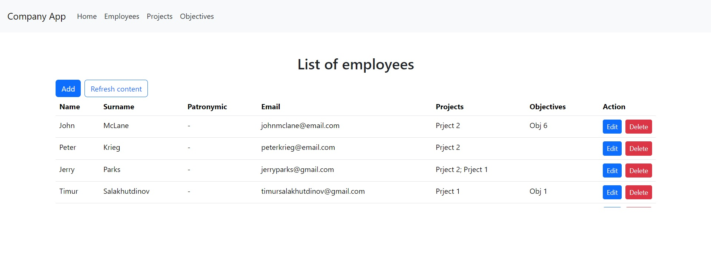

## Использованные технологии

**Серверная часть**\
Хранилище данных - MS SQL Server\
Доступ к данным - ASP.NET Core (Web API)
Взаимодействие с бд - EF Core

**Клиент**\
ReactJS, Bootstrap

## Описание
Программа представляет собой CRUD-функционал для взаимодействия с  сущностями Employee, Project, Objective. Между сущностями установлены соответствующие связи, определенные в ПЗ. Детали - в проекте.

## Пример работы 
Создание сотрудника\

Список сотрудников\
